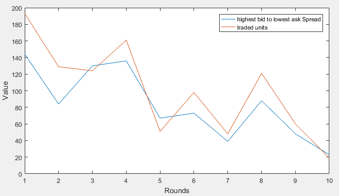

### Agent Based Simulator in a Double Auction Market

Hypotheses:
* Buyers & Sellers: 20 each
* Initially each seller owns 30 units.
* Each buyer i ∈ {1, . . . , 20}, has a fixed valuation that is a random number between 1 and 200.

At every round, buyers and sellers place their orders that are of the following form:
* A buyer’s order (b, q) is such that:
  * **b (bid)** is the maximum amount the corresponding buyer would be willing to spend for one unit of the item.
  * **q (quantity)** is the number of units the corresponding buyer would like to buy at this round (for the given price)

* Similarly, a seller’s order *'a'* is such that:
  * **a (ask)** is the minimum amount of money the corresponding seller would be willing to get for one unit of the item at this round of the simulation.

After all orders have been placed in each round, the maximum number of trades is being implemented while giving priority to high bids and low asks. Note that a buyer’s order can be matched to more than one sellers, e.g. if two sellers only have one remaining unit of the item each and a buyer wishes to buy two units. A trade can be performed if the bid is at least as high as the ask. Once a seller sells their 30 units they are no longer considered for trades.

||
|:--:|
| 
After all trades in a simulation of 10 rounds
|
