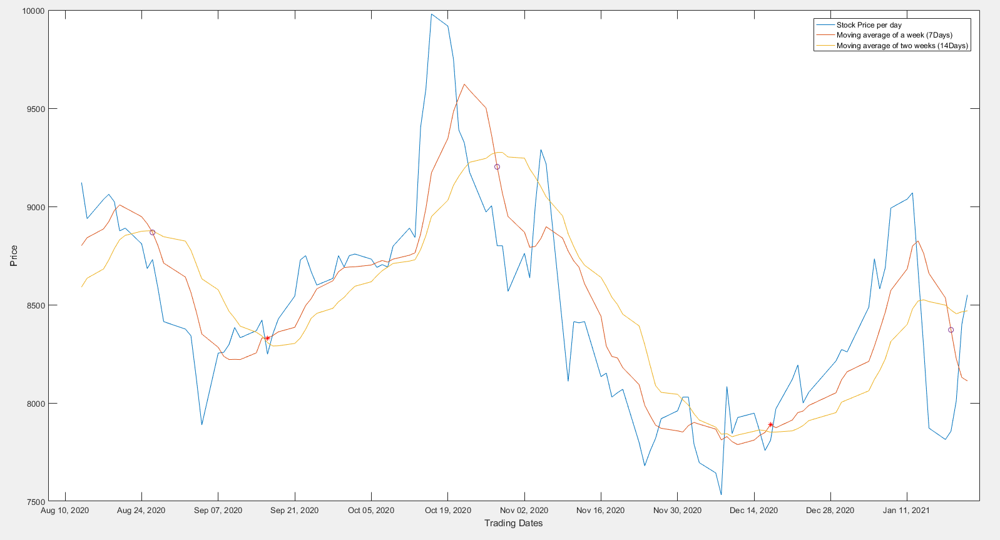
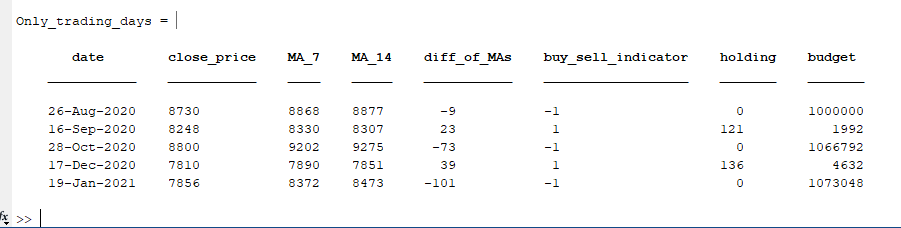
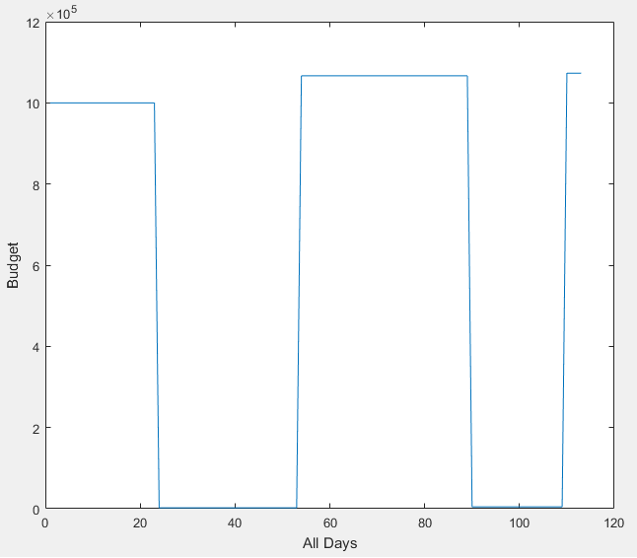

### Moving Average Trading Strategy

I have used JustEat 6M stocks daily closing prices data.

Hypotheses:
- Initial Budget: £1M
- If 7MA crosses the 14MA from below, then buy the entire budget and if the 7MA crosses the 14MA from above, then sell the entire portfolio.

||
|:--:|
| 
Fig.1 - Visualizing moving averages to make approximations
|

>The **Star point marker** in the [Fig.1] marks the point where we potentially buy our entire budget as per our hypothesis to make profit. In contrast, the **Circle point marker** marks the point where we sell our entire portfolio as per our strategy.

The code outputs two tables: (1) a resultant matrix (for all days) and (2) a summary table. We can refer to summary table below for when our algorithm makes the deal.

||
|:--:|
| 
Fig.2 - Algorithm buying and selling deals
|

In an ideal case, we only made a profit with no loss in each deal resulting in **£73,048** profit with £1,073,048 amount out of our initial budget of £1,000,000.

||
|:--:|
| 
Fig.3 - Budget
|
